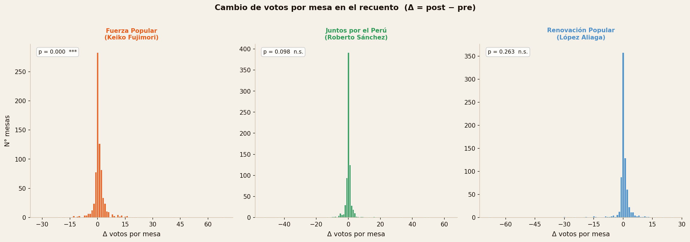
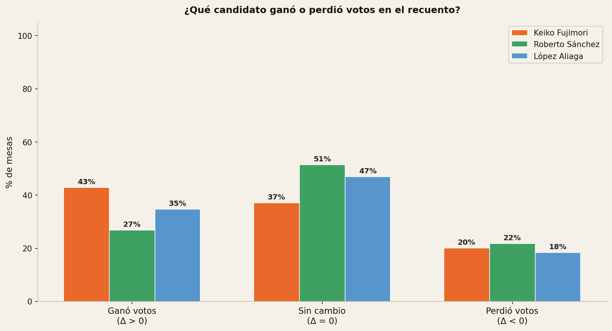
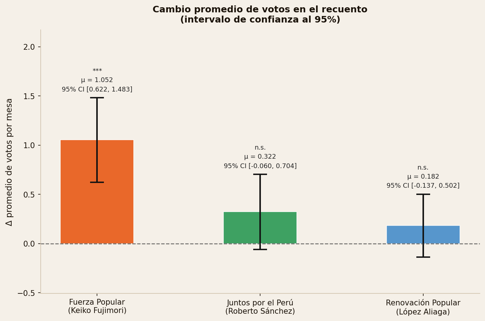
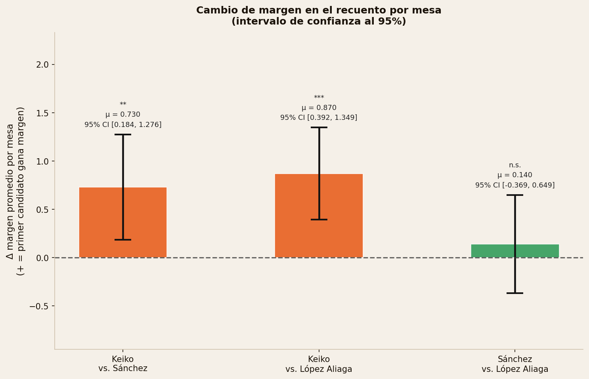

```{r setup, include=FALSE}
knitr::opts_chunk$set(echo = FALSE, warning = FALSE, message = FALSE,
                      fig.pos = "H", out.extra = "")
```

# Introducción

Las elecciones generales del Perú de 2026 marcan la primera vez en la historia electoral del país en que las cédulas de votación son conservadas en lugar de destruidas al cierre del escrutinio. Esta modificación normativa abre la posibilidad, también inédita, de realizar recuentos físicos que permitan comparar directamente el resultado consignado en el acta con el contenido real de las cédulas.

En el marco del proceso electoral de abril de 2026, el Jurado Nacional de Elecciones (JNE) ordenó el recuento de 897 mesas de votación. Este documento presenta un análisis estadístico de esos recuentos, enfocado en tres candidatos presidenciales: Keiko Fujimori (Fuerza Popular), Roberto Sánchez (Juntos por el Perú) y Rafael López Aliaga (Renovación Popular).


# Muestra

El punto de partida son las 897 mesas enviadas a recuento. A partir de ese universo, se aplicaron los siguientes filtros:

| Criterio | Mesas restantes |
|---|---|
| Total enviadas a recuento | 897 |
| Se eliminan 3 con audiencia pública pendiente | 894 |
| Se eliminan 57 sin imagen inicial del acta (pre-recuento) | 837 |
| Se eliminan 57 adicionales: 41 en blanco originalmente, 13 declaradas nulas, 3 en ambas situaciones | 780 |
| Se eliminan 17 sin pronunciamiento emitido aún | **763** |

**La muestra final de análisis comprende 763 mesas.**

# Metodología

Para cada mesa se registraron los votos de cada candidato tanto en el acta original (*pre-recuento*) como en el resultado del recuento físico de cédulas (*post-recuento*). Se define el **delta** de cada mesa como:

$$\Delta_i = \text{votos}_{\text{post}} - \text{votos}_{\text{pre}}$$

Un valor positivo implica que el recuento físico arroja más votos que el acta; uno negativo, que arroja menos. La hipótesis nula en todos los tests es que el cambio promedio es cero.

Para el análisis de márgenes se construye, para cada par de candidatos y cada mesa, el **cambio en el margen**:

$$\Delta\text{margen}_{i,AB} = \Delta_{i,A} - \Delta_{i,B}$$

El test es un t-test de una muestra contra cero sobre el promedio de estos valores. Todos los intervalos de confianza son al 95%. Niveles de significancia: \* $p < 0.05$, \*\* $p < 0.01$, \*\*\* $p < 0.001$.


# Resultados

## Distribución de cambios por candidato

```{r fig1, out.width="100%", fig.cap="Distribución del cambio de votos por mesa en el recuento (post menos pre). Cada barra representa un valor entero de cambio."}

```

## Proporción de mesas con ganancias o pérdidas

```{r fig2, out.width="88%", fig.cap="Proporción de mesas en que cada candidato ganó votos, no registró cambio, o perdió votos en el recuento."}

```

Keiko Fujimori ganó votos netos en el 43% de las mesas recuentadas, sustancialmente más que Sánchez (27%) o López Aliaga (35%). La proporción de mesas en que Keiko perdió votos (20%) es comparable a la de los otros dos candidatos (22% y 18%). El patrón no es simétrico: Keiko gana más frecuentemente y con mayor magnitud, pero no pierde con mayor frecuencia. Esto es inconsistente con una hipótesis de errores aleatorios de transcripción.

## Cambio promedio por candidato

```{r fig3, out.width="85%", fig.cap="Cambio promedio de votos por mesa con intervalos de confianza al 95%."}

```

En promedio, Keiko Fujimori obtiene **1.052 votos más por mesa** en el recuento que en el acta original (IC 95%: [0.622, 1.483], $p < 0.001$). Los cambios para Sánchez ($\mu = 0.322$, $p = 0.098$) y López Aliaga ($\mu = 0.182$, $p = 0.263$) no son estadísticamente distinguibles de cero.

## Cambio en el margen entre candidatos

```{r fig4, out.width="85%", fig.cap="Cambio promedio en el margen entre pares de candidatos, con intervalos de confianza al 95%."}

```

El recuento no solo modifica los votos absolutos de cada candidato — modifica también los márgenes relativos entre ellos. Los resultados son los siguientes:

- **Keiko vs. Sánchez**: el margen de Keiko crece en promedio **0.730 votos por mesa** (IC 95%: [0.184, 1.276], $p = 0.009$, \*\*)
- **Keiko vs. López Aliaga**: el margen de Keiko crece en promedio **0.870 votos por mesa** (IC 95%: [0.392, 1.349], $p < 0.001$, \*\*\*)
- **Sánchez vs. López Aliaga**: sin cambio significativo ($\mu = 0.140$, $p = 0.787$, n.s.)

El patrón es consistente: el recuento beneficia la posición relativa de Keiko frente a ambos contrincantes. El margen entre los otros dos candidatos no se ve afectado. 


# Discusión

Quiero ser muy cuidadoso cuando digo lo siguiente.

Estos resultados no pueden generalizarse mecánicamente a todas las mesas de la elección de 2026, ni a las de la segunda vuelta de 2021 entre Keiko Fujimori y Pedro Castillo. Los recuentos corresponden a un subconjunto específico de mesas, en un contexto electoral distinto.

Sin embargo, hay un dato que merece ser puesto en perspectiva. Uno de los argumentos centrales del equipo de Keiko durante la controversia electoral de 2021 fue que el resultado consignado en las actas difería del que arrojaban las cédulas, de una manera que sistemáticamente perjudicaba su margen sobre Castillo. Ese argumento era técnicamente inverificable en ese momento: las cédulas habían sido destruidas.

Los 763 recuentos aquí analizados constituyen la primera evidencia empírica disponible sobre si ese tipo de discrepancia puede existir Y lo que muestran es que, en estas mesas, **el acta original subestima el margen de Keiko de manera estadísticamente significativa**: en 0.730 votos por mesa sobre Sánchez, y en 0.870 votos por mesa sobre López Aliaga.

Para dimensionar esa magnitud: el margen de Pedro Castillo sobre Keiko Fujimori en la segunda vuelta de 2021 fue de aproximadamente **0.533 votos por mesa**. El cambio en el margen que el recuento produce en favor de Keiko, en candidatos distintos, en un año distinto, supera esa cifra.

Esto no demuestra que Keiko ganó en 2021. Pero sí es evidencia de que el resultado consignado en actas puede diferir del resultado de las cédulas de una manera suficientemente sistemática como para impactar el resultado de una elección — y de que conservar las cédulas y realizar recuentos no es un formalismo: es lo que hace posible verificar si el acta refleja fielmente la voluntad del elector.

# Conclusión

El análisis de 763 recuentos en las elecciones generales del Perú de 2026 produce tres hallazgos estadísticamente robustos:

1. El recuento físico de cédulas genera en promedio **1.052 votos adicionales para Keiko Fujimori** por mesa respecto al acta original ($p < 0.001$). Los cambios para Sánchez y López Aliaga no son distinguibles de cero.

2. Este resultado no obedece a un sesgo general del proceso de recuento: **el margen de Sánchez y López Aliaga no varía de manera significativa**, lo que descarta una explicación sistémica que no sea específica a Keiko.

3. El margen de Keiko sobre Sánchez crece en **0.730 votos por mesa** ($p = 0.009$) y sobre López Aliaga en **0.870 votos por mesa** ($p < 0.001$). Ambos efectos son consistentes entre sí y superan en magnitud el margen que separó a Castillo de Keiko en 2021.

La primera experiencia peruana de conservación de cédulas y recuento físico de votos produce evidencia concreta de que la discrepancia entre acta y cédula existe, es medible, y no es aleatoria.
